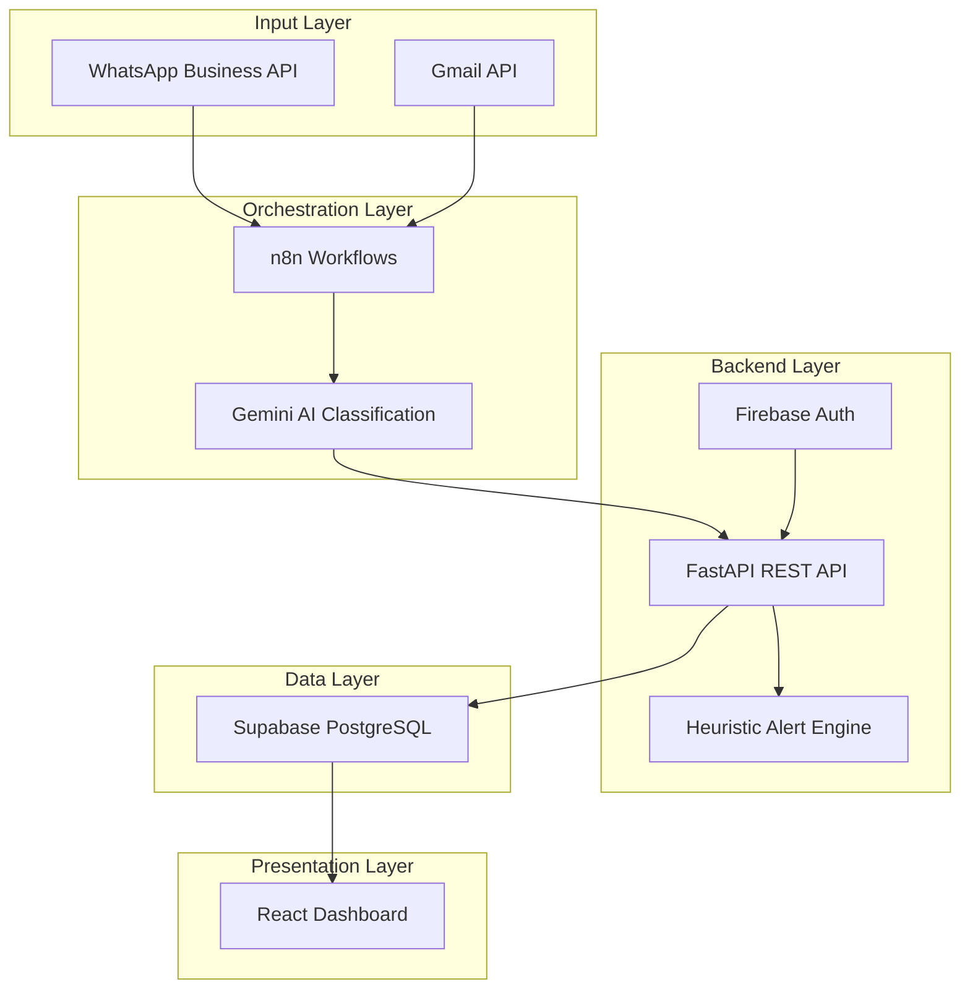

<h1 align="center">AutoMate — AI-Powered Autonomous Operations Assistant</h1>

<p align="center">
  <em>An intelligent, always-on operations assistant for small businesses that automates customer communication, order processing, payment tracking, and inventory management using AI and workflow automation.</em>
</p>

<p align="center">
  
  
  
  
  
  
</p>

---

## 🚀 Overview

**AutoMate** transforms how small businesses handle daily operations. Instead of manually logging orders, tracking payments, and monitoring inventory, OpsAgent **automatically ingests customer messages from WhatsApp and Gmail**, classifies them using **Google Gemini AI**, routes them through intelligent **n8n workflows**, and surfaces actionable insights on a beautiful **real-time dashboard**.

> **Core Principle:** The shopkeeper should never have to manually enter data that a customer already communicated. If a customer says _"send 10 packets"_, that IS the order — the system processes it automatically.

```
Customer sends WhatsApp ─→ n8n Webhook ─→ Gemini AI classifies intent
                                              │
              ┌───────────────────────────────┤
              ▼              ▼                ▼              ▼
         🛒 Order      💰 Payment       📦 Query       🔧 Complaint
         Processing     Tracking        Response        Resolution
              │              │                │              │
              └──────────────┴────────────────┴──────────────┘
                                    │
                            FastAPI Backend
                                    │
                        ┌───────────┴───────────┐
                        ▼                       ▼
                Supabase (PostgreSQL)    React Dashboard
```

---

## ✨ Key Features

### 🤖 AI-Powered Message Classification
- Ingests customer messages from **WhatsApp** and **Gmail** via n8n webhooks
- **Google Gemini AI** classifies intents: `order`, `payment`, `complaint`, `query`, `general`
- Confidence-based auto-processing (>85% auto-acts, 60–85% flags for review)
- Supports multilingual input (Hindi/English mix common in Indian businesses)

### 📊 Real-Time Command Center Dashboard
- **KPI Cards** — Today's orders, pending payments, active alerts, inventory warnings
- **Smart Alerts Panel** — Proactive alerts with one-click actions
- **Activity Feed** — Real-time log of all automated actions
- **Analytics Charts** — Order trends, payment flow, inventory levels

### 🛒 Automated Order Management
- Orders auto-created from classified WhatsApp/Gmail messages
- Status pipeline: `Pending → Confirmed → Fulfilled → Cancelled`
- Linked to customers and inventory for stock validation
- Auto-reply confirmation sent to customers

### 💰 Payment Tracking & Reminders
- Tracks payments: `received`, `pending`, `overdue`
- Proactive overdue payment alerts with configurable thresholds
- Cash flow visibility at a glance

### 👥 Customer Relationship Management (CRM)
- Auto-populated customer directory from incoming messages
- Per-customer history: orders, payments, conversations
- Customer tagging and segmentation

### 📦 Inventory & Billing
- Excel/CSV upload for bulk inventory import
- Low-stock and stockout alert engine with custom thresholds
- Bill generation linked to inventory with auto stock deduction
- Master view toggle for inventory management

### ⚠️ Proactive Alert Engine
- **Low Stock Alerts** — Triggered when inventory falls below threshold
- **Overdue Payment Reminders** — Auto-sent via WhatsApp
- **Complaint Escalation** — High-priority alerts for customer issues
- **Order Spike Detection** — Flags unusual demand patterns

### 🔄 n8n Workflow Automation
- Visual workflow builder for message routing
- Sub-workflows for each intent type (order, payment, complaint, query)
- Scheduled cron jobs: daily summaries, stock checks, payment reminders

---

## 🛠️ Tech Stack

| Layer | Technology |
|-------|-----------|
| **Backend** | Python, FastAPI, Pydantic, Uvicorn |
| **Frontend** | React 19, Vite, Tailwind CSS, Zustand |
| **Database** | Supabase (PostgreSQL + Realtime + RLS) |
| **Authentication** | Firebase Auth (JWT) |
| **AI/ML** | Google Gemini API |
| **Automation** | n8n (workflow orchestration) |
| **Messaging** | WhatsApp Business API, Gmail API |
| **Data Processing** | Pandas, OpenPyXL |
| **Icons** | Lucide React |
| **HTTP Client** | Axios |
| **Rate Limiting** | SlowAPI |

---

## 📁 Project Structure

```
SR-21-Invictus-main/
├── backend/
│   ├── main.py                 # FastAPI app entry point
│   ├── config.py               # Environment configuration
│   ├── database.py             # Supabase client setup
│   ├── models.py               # Pydantic schemas for all entities
│   ├── auth.py                 # Firebase JWT middleware
│   ├── requirements.txt        # Python dependencies
│   ├── core/
│   │   ├── logic.py            # Heuristic alert engine (stockout, payments)
│   │   └── utils.py            # Utility functions
│   └── routes/
│       ├── auth_routes.py      # Auth & user sync
│       ├── dashboard.py        # Dashboard aggregation API
│       ├── ledger.py           # Ledger CRUD
│       ├── billing.py          # Bill creation & management
│       ├── upload.py           # Excel/CSV import pipeline
│       ├── orders.py           # Order processing API
│       ├── payments.py         # Payment tracking API
│       ├── customers.py        # Customer CRM API
│       ├── conversations.py    # Message ingestion API
│       └── alerts.py           # Alert management API
├── frontend/
│   ├── index.html              # App entry HTML
│   ├── package.json            # Node dependencies
│   ├── vite.config.js          # Vite configuration
│   └── src/
│       ├── App.jsx             # Root component with routing
│       ├── main.jsx            # React entry point
│       ├── index.css           # Global styles
│       ├── api/                # Axios API client
│       ├── hooks/              # Custom React hooks
│       ├── lib/                # Firebase config
│       ├── store/              # Zustand state management
│       ├── components/         # Reusable UI components (Sidebar, Layout)
│       └── pages/
│           ├── DashboardPage.jsx
│           ├── OrdersPage.jsx
│           ├── PaymentsPage.jsx
│           ├── CustomersPage.jsx
│           ├── ConversationsPage.jsx
│           ├── InventoryListPage.jsx
│           ├── BillingPage.jsx
│           ├── AlertsPage.jsx
│           ├── ComplaintsPage.jsx
│           ├── QueriesPage.jsx
│           ├── LedgerPage.jsx
│           ├── UploadPage.jsx
│           ├── ProfilePage.jsx
│           └── LoginPage.jsx
├── supabase/                   # Database migrations & schema
├── n8n.json                    # n8n workflow definitions
├── inventory.csv               # Sample inventory data
├── render.yaml                 # Render deployment config
├── .env.example                # Environment variables template
└── senior_track_ps2.pdf        # Problem statement document
```

---

## ⚡ Getting Started

### Prerequisites
- **Python 3.10+**
- **Node.js 18+** & npm
- **Supabase** account (free tier works)
- **Firebase** project (for authentication)
- **Google Gemini API** key
- **n8n** instance (cloud or self-hosted)

### 1. Clone the Repository

```bash
git clone https://github.com/your-username/SR-21-Invictus.git
cd SR-21-Invictus-main
```

### 2. Environment Setup

```bash
cp .env.example .env
# Fill in your Supabase, Firebase, and API credentials
```

### 3. Backend Setup

```bash
cd backend
python -m venv venv
# Windows
venv\Scripts\activate
# macOS/Linux
source venv/bin/activate

pip install -r requirements.txt
uvicorn main:app --reload --port 8000
```

### 4. Frontend Setup

```bash
cd frontend
npm install
npm run dev
```

### 5. n8n Workflow

Import `n8n.json` into your n8n instance to set up the automated message processing workflows.

---

## 🔗 API Documentation

Once the backend is running, visit:
- **Swagger UI**: [http://localhost:8000/docs](http://localhost:8000/docs)
- **ReDoc**: [http://localhost:8000/redoc](http://localhost:8000/redoc)

### Key Endpoints

| Method | Endpoint | Description |
|--------|----------|-------------|
| `POST` | `/api/conversations/ingest` | Ingest incoming WhatsApp/Gmail message |
| `POST` | `/api/orders` | Create order (auto or manual) |
| `GET`  | `/api/orders` | List all orders with filters |
| `POST` | `/api/payments` | Log payment |
| `GET`  | `/api/payments/overdue` | Get overdue payments |
| `GET`  | `/api/customers` | List customers |
| `GET`  | `/api/dashboard/summary` | Dashboard KPIs & analytics |
| `GET`  | `/api/alerts` | Get active alerts |
| `POST` | `/api/upload` | Import Excel/CSV data |

---

## 🏗️ Architecture



---

## 👥 Team

**Team SR-21 Invictus** — Built for PS02-ISTE Hackathon Track

---

## 📄 License

This project was developed as part of the **Invictus Hackathon**. All rights reserved by Team SR-21.


