# OpsAgent — Requirements Master Document
## Autonomous Operations Assistant for Small Businesses

> **Team:** SR-21 Invictus | **Hackathon PS:** PS02-ISTE

---

## 1. Executive Summary

**OpsAgent** is an always-on operations assistant for small businesses that **automatically ingests customer messages from WhatsApp/Gmail**, classifies them via AI (Gemini API), routes them through automated n8n workflows, and surfaces everything on a real-time dashboard for the shopkeeper.


---

## 2. Current Codebase Assessment

### What Exists (✅ Keep & Reuse)

| Component | Status | Notes |
|-----------|--------|-------|
| FastAPI backend scaffold | ✅ Solid | `main.py`, CORS, rate limiting, modular routes |
| Supabase integration | ✅ Working | Client setup, schema with RLS, JSONB flexible storage |
| Firebase Auth | ✅ Working | JWT verification middleware, user sync |
| Pydantic models | ✅ Good | Strict validation schemas for all entities |
| Ledger CRUD system | ⚠️ Partial reuse | Flexible JSONB schema fits orders/payments too |
| Heuristic alert engine | ⚠️ Extend | `core/logic.py` has stockout checks — needs AI-powered expansion |
| Dashboard API | ⚠️ Extend | Aggregation logic exists — needs real-time feed |
| Frontend React+Vite | ✅ Reuse shell | Auth flow, sidebar, page routing all working |
| Excel upload pipeline | ✅ Keep | CSV/XLSX import with Pandas still useful for initial data |

### What Needs to Change (🔄 Pivot)

| Current Approach | New Approach | Reason |
|------------------|-------------|--------|
| Manual Excel upload as primary input | WhatsApp/Gmail triggers via n8n as primary input | Problem statement demands *minimal manual data entry* |
| Passive dashboard (user checks it) | Proactive alerts + auto-actions (system pushes to user) | PS explicitly says *proactive, not passive* |
| Static heuristic rules only | Gemini AI classification + heuristic rules | Need intelligent message understanding |
| No messaging integration | WhatsApp Business API + Gmail integration | Core differentiator of the solution |
| Ledger-only data model | Orders, Payments, Inventory, Customers, Conversations | Need domain-specific entities |

---

## 3. System Architecture

### 3.1 High-Level Architecture

```mermaid
graph TB
    subgraph "Input Layer (n8n)"
        WA["WhatsApp Business API"]
        GM["Gmail API"]
        WH["n8n Webhooks"]
        WA --> WH
        GM --> WH
    end

    subgraph "Intelligence Layer"
        AI["Gemini API<br/>Intent Classification"]
        WH --> AI
        AI --> ROUTER["Intent Router"]
    end

    subgraph "Processing Layer (n8n Sub-workflows)"
        ROUTER --> OB["🛒 Order Bot"]
        ROUTER --> PB["💰 Payment Bot"]
        ROUTER --> CB["📦 Stock Query Bot"]
        ROUTER --> IB["🔧 Issue Bot"]
        ROUTER --> GB["💬 General Bot"]
    end

    subgraph "Backend (FastAPI)"
        API["REST API"]
        LOGIC["Business Logic Engine"]
        ALERT["Alert Engine"]
        OB & PB & CB & IB & GB --> API
        API --> LOGIC
        LOGIC --> ALERT
    end

    subgraph "Data Layer"
        DB[(Supabase PostgreSQL)]
        API --> DB
    end

    subgraph "Output Layer"
        DASH["React Dashboard"]
        REPLY["WhatsApp Auto-Reply"]
        NOTIF["Push Notifications"]
        DB --> DASH
        API --> REPLY
        ALERT --> NOTIF
    end
```



### 3.2 Tech Stack (Final)

| Layer | Technology | Justification |
|-------|-----------|---------------|
| **Orchestration** | n8n (self-hosted or cloud) | Visual workflow builder, webhooks, 400+ integrations |
| **AI/Classification** | Google Gemini API | Fast, cheap, good at structured extraction |
| **Backend** | FastAPI (Python 3.10+) | Already built, async, fast |
| **Database** | Supabase (PostgreSQL + Realtime) | Already set up, JSONB flexibility, realtime subscriptions |
| **Auth** | Firebase Auth | Already integrated |
| **Frontend** | React + Vite + Tailwind | Already built |
| **Messaging** | WhatsApp Business API (via n8n) | Primary customer channel for small businesses in India |
| **Email** | Gmail API (via n8n) | Secondary channel |
| **Deployment** | Vercel (FE) + Railway (BE) + n8n Cloud | As planned |

---

## 4. Data Model (Revised Schema)

### 4.1 New Tables (alongside existing `users`, `ledgers`, `ledger_entries`, `alerts`)

```sql
-- ============================================
-- CUSTOMERS (auto-created from messages)
-- ============================================
CREATE TABLE customers (
  id UUID PRIMARY KEY DEFAULT gen_random_uuid(),
  user_id UUID REFERENCES users(id) ON DELETE CASCADE,
  name TEXT,
  phone TEXT,             -- WhatsApp number
  email TEXT,             -- Gmail address
  source TEXT DEFAULT 'whatsapp',  -- 'whatsapp' | 'gmail' | 'manual'
  tags JSONB DEFAULT '[]',
  total_orders INT DEFAULT 0,
  total_spent NUMERIC DEFAULT 0,
  created_at TIMESTAMPTZ DEFAULT NOW(),
  updated_at TIMESTAMPTZ DEFAULT NOW()
);

-- ============================================
-- ORDERS (created from classified messages)
-- ============================================
CREATE TABLE orders (
  id UUID PRIMARY KEY DEFAULT gen_random_uuid(),
  user_id UUID REFERENCES users(id) ON DELETE CASCADE,
  customer_id UUID REFERENCES customers(id),
  order_number TEXT NOT NULL,
  items JSONB NOT NULL DEFAULT '[]',
  total NUMERIC DEFAULT 0,
  status TEXT DEFAULT 'pending',  -- pending | confirmed | fulfilled | cancelled
  source TEXT DEFAULT 'whatsapp',
  source_message_id UUID,
  notes TEXT,
  created_at TIMESTAMPTZ DEFAULT NOW(),
  updated_at TIMESTAMPTZ DEFAULT NOW()
);

-- ============================================
-- PAYMENTS (tracked from messages)
-- ============================================
CREATE TABLE payments (
  id UUID PRIMARY KEY DEFAULT gen_random_uuid(),
  user_id UUID REFERENCES users(id) ON DELETE CASCADE,
  customer_id UUID REFERENCES customers(id),
  order_id UUID REFERENCES orders(id),
  amount NUMERIC NOT NULL,
  method TEXT DEFAULT 'unknown',  -- upi | cash | bank_transfer | unknown
  status TEXT DEFAULT 'pending',  -- pending | received | overdue
  due_date TIMESTAMPTZ,
  received_date TIMESTAMPTZ,
  source TEXT DEFAULT 'whatsapp',
  created_at TIMESTAMPTZ DEFAULT NOW()
);

-- ============================================
-- CONVERSATIONS (message log with AI metadata)
-- ============================================
CREATE TABLE conversations (
  id UUID PRIMARY KEY DEFAULT gen_random_uuid(),
  user_id UUID REFERENCES users(id) ON DELETE CASCADE,
  customer_id UUID REFERENCES customers(id),
  channel TEXT NOT NULL,     -- 'whatsapp' | 'gmail'
  direction TEXT NOT NULL,   -- 'inbound' | 'outbound'
  raw_message TEXT NOT NULL,
  ai_intent TEXT,            -- 'order' | 'payment' | 'complaint' | 'query' | 'general'
  ai_confidence NUMERIC,
  ai_extracted_data JSONB,   -- structured data extracted by Gemini
  action_taken TEXT,         -- what the system did
  status TEXT DEFAULT 'processed',
  created_at TIMESTAMPTZ DEFAULT NOW()
);

-- ============================================
-- ACTIVITY LOG (audit trail)
-- ============================================
CREATE TABLE activity_log (
  id UUID PRIMARY KEY DEFAULT gen_random_uuid(),
  user_id UUID REFERENCES users(id) ON DELETE CASCADE,
  entity_type TEXT NOT NULL,  -- 'order' | 'payment' | 'inventory' | 'alert'
  entity_id UUID,
  action TEXT NOT NULL,       -- 'created' | 'updated' | 'auto_processed'
  description TEXT,
  source TEXT DEFAULT 'system',  -- 'system' | 'n8n' | 'manual'
  created_at TIMESTAMPTZ DEFAULT NOW()
);
```

### 4.2 Keep Existing Tables
- `users` — no changes needed
- `ledgers` + `ledger_entries` — keep for manual inventory and flexible data
- `bills` — keep for manual billing (alongside automated orders)
- `alerts` — extend with new alert types

---

## 5. n8n Workflow Design

### 5.1 Master Flow: Message Ingestion

```
TRIGGER: WhatsApp Incoming Message (Webhook)
    │
    ├─ 1. Extract sender phone, message text, timestamp
    │
    ├─ 2. POST to FastAPI → /api/conversations/ingest
    │     (logs raw message, finds/creates customer)
    │
    ├─ 3. Call Gemini API → Classify Intent
    │     Prompt: "Classify this business message into:
    │              order, payment, complaint, query, general.
    │              Extract structured data (items, amounts, dates)."
    │
    │     Response: { intent: "order", confidence: 0.95,
    │                 data: { items: [{name: "Widget A", qty: 5}] } }
    │
    ├─ 4. POST to FastAPI → /api/conversations/{id}/classify
    │     (stores AI classification)
    │
    ├─ 5. SWITCH on intent:
    │     │
    │     ├─ "order" → Sub-workflow: Order Processing
    │     │     POST /api/orders (create order, check inventory)
    │     │     → auto-reply: "Order received! ✅ Items: ..."
    │     │
    │     ├─ "payment" → Sub-workflow: Payment Tracking
    │     │     POST /api/payments (log payment info)
    │     │     → auto-reply: "Payment noted! 💰 Balance: ..."
    │     │
    │     ├─ "complaint" → Sub-workflow: Issue Handling
    │     │     POST /api/alerts (create high-priority alert)
    │     │     → auto-reply: "We're looking into this! 🔧"
    │     │     → notify owner immediately
    │     │
    │     ├─ "query" → Sub-workflow: Info Response
    │     │     GET relevant data from API
    │     │     → Gemini generates contextual reply
    │     │     → auto-reply with answer
    │     │
    │     └─ "general" → Log & acknowledge
    │
    └─ 6. POST auto-reply via WhatsApp API
```

### 5.2 Scheduled Workflows (Proactive Intelligence)

| Workflow | Schedule | Action |
|----------|----------|--------|
| **Stock Alert Check** | Every 6 hours | Run heuristic engine → create alerts for low stock |
| **Payment Reminders** | Daily 9 AM | Find overdue payments → send WhatsApp reminders to customers |
| **Daily Summary** | Daily 8 PM | Compile day's orders/payments → send digest to owner |
| **Supplier Reorder** | Daily | Check items below reorder point → draft reorder alerts |

---

## 6. FastAPI Endpoints (New + Modified)

### 6.1 New Endpoints

```
# Conversations (n8n → Backend)
POST   /api/conversations/ingest           # Log incoming message
PUT    /api/conversations/{id}/classify     # Store AI classification
GET    /api/conversations                   # List all conversations (paginated)
GET    /api/conversations/stats             # Message analytics

# Orders (auto-created from messages)
POST   /api/orders                          # Create order (from n8n or manual)
GET    /api/orders                          # List orders (filterable)
GET    /api/orders/{id}                     # Order detail
PUT    /api/orders/{id}/status              # Update order status
GET    /api/orders/pending                  # Pending orders count

# Payments
POST   /api/payments                        # Log payment
GET    /api/payments                        # List payments
GET    /api/payments/overdue                # Overdue payments
PUT    /api/payments/{id}/confirm           # Mark as received

# Customers
GET    /api/customers                       # List customers
GET    /api/customers/{id}                  # Customer detail + history
POST   /api/customers                       # Manual customer creation

# Activity Feed
GET    /api/activity                        # Recent activity log (real-time feed)

# n8n Webhooks
POST   /api/webhooks/whatsapp              # WhatsApp message webhook
POST   /api/webhooks/gmail                 # Gmail message webhook
```

### 6.2 Keep Existing Endpoints
All existing endpoints from the current `API_CONTRACT.md` remain — ledgers, entries, billing, dashboard, upload, alerts, auth.

---

## 7. Frontend Pages (Revised)

### 7.1 Dashboard (Primary View) — **COMPLETE REDESIGN**

The owner opens the app and instantly sees:

| Section | Content |
|---------|---------|
| **Command Center** | Real-time activity feed — "Customer X placed order", "Payment received from Y" |
| **KPI Cards** | Today's orders, pending payments, active alerts, inventory warnings |
| **Smart Alerts Panel** | Proactive alerts with **one-click actions** (confirm order, send reminder, reorder stock) |
| **Quick Stats** | Revenue today, orders this week, messages processed |
| **Charts** | Order trends, payment flow, inventory levels |

### 7.2 Orders Page (NEW)
- Live list of all orders (auto + manual)
- Status pipeline: Pending → Confirmed → Fulfilled
- Click to expand and see source message
- Quick actions: Confirm, Mark Shipped, Cancel

### 7.3 Conversations Page (NEW)  
- WhatsApp/Gmail message log with AI-tagged intents
- Color-coded by intent (🟢 order, 🔵 payment, 🔴 complaint, ⚪ query)
- See what action the system took for each message
- Override/correct if AI got it wrong

### 7.4 Payments Page (NEW)
- Tracks all payments: received + pending + overdue
- One-click "Send Reminder" via WhatsApp
- Cash flow summary

### 7.5 Customers Page (NEW)
- Auto-populated customer directory
- Per-customer history: orders, payments, conversations
- Lifetime value, frequency

### 7.6 Keep Existing Pages
- **Home** → Ledger grid (for manual data management)
- **Ledger Detail** → Inline editing
- **Billing** → Manual bill creation
- **Upload** → Excel/CSV import
- **Login** → Firebase auth

---

## 8. AI Classification System (Gemini)

### 8.1 Prompt Strategy

```
System: You are a business message classifier for a small Indian shop.
Given a customer message, return a JSON with:
{
  "intent": "order" | "payment" | "complaint" | "query" | "general",
  "confidence": 0.0-1.0,
  "extracted_data": {
    "items": [{"name": "...", "quantity": N}],  // if order
    "amount": N,          // if payment
    "payment_method": "", // if payment
    "issue": "",          // if complaint
    "question": ""        // if query
  },
  "suggested_reply": "..." // suggested auto-reply in the customer's language
}

Rules:
- Indian business context (Hindi/English mix is common)
- "Bhai 5 packet chips bhejo" → order
- "Payment kar diya UPI se 500 rupees" → payment  
- "Saamaan kharab aaya" → complaint
- "Rate kya hai cement ka?" → query
```

### 8.2 Confidence Thresholds

| Confidence | Action |
|-----------|--------|
| > 0.85 | Auto-process + auto-reply |
| 0.60 - 0.85 | Process but **flag for owner review** |
| < 0.60 | Log only, notify owner: "Couldn't classify, please review" |

---

## 9. Proactive Features (Key Differentiators)

These are what make OpsAgent *proactive, not passive*:

| Feature | Trigger | Action |
|---------|---------|--------|
| **Low Stock Alert** | Inventory quantity < threshold | Alert + "Reorder from supplier?" |
| **Overdue Payment Reminder** | Payment due_date passed | Auto-send WhatsApp reminder to customer |
| **Order Spike Detection** | 3x normal order volume | Alert: "Unusual demand for X — check stock" |
| **Daily Ops Summary** | 8 PM daily (n8n cron) | WhatsApp digest to owner with day's recap |
| **Supplier Follow-up** | Reorder pending > 2 days | Reminder to follow up with supplier |
| **Cash Flow Warning** | Projected expenses > projected income | Alert: "Cash crunch expected this week" |

---

## 10. Demo Flow (Hackathon Presentation)

### Critical Path for "Wow Factor"

```
1. Shopkeeper opens OpsAgent dashboard (clean, live, zero-config)

2. Customer sends WhatsApp: "Bhai 10 packet Maggi aur 5 kg aata bhejo"
    → n8n triggers → Gemini classifies as ORDER
    → Dashboard shows: "🛒 New Order from +91-XXXXX"
    → WhatsApp auto-replies: "Order received! 10x Maggi, 5kg Aata ✅"

3. Same customer sends: "500 rupees UPI kar diya"
    → Classified as PAYMENT
    → Dashboard updates: "💰 ₹500 received from +91-XXXXX"
    → Auto-reply: "Payment confirmed! Balance: ₹250 pending"

4. Alert pops up: "⚠️ Maggi stock down to 5 packets (threshold: 20)"
    → Owner clicks "Reorder" → Supplier notification drafted

5. Owner glances at daily summary — total orders, revenue, pending items
```

---

## 11. Development Phases

### Phase 0: Setup (2 hours)
- [ ] Set up n8n (cloud or self-hosted)
- [ ] Get WhatsApp Business API sandbox / Twilio WhatsApp
- [ ] Get Gemini API key
- [ ] Run new DB migrations on Supabase

### Phase 1: Backend — New Models & APIs (4 hours)
- [ ] Add new tables: `customers`, `orders`, `payments`, `conversations`, `activity_log`
- [ ] Implement conversation ingestion endpoint
- [ ] Implement order CRUD
- [ ] Implement payment tracking
- [ ] Implement customer auto-creation
- [ ] Implement activity log
- [ ] Extend alert engine with new alert types

### Phase 2: n8n Workflows (4 hours)
- [ ] WhatsApp webhook → Gemini classification → intent routing
- [ ] Order processing sub-workflow
- [ ] Payment tracking sub-workflow
- [ ] Complaint/alert sub-workflow
- [ ] Auto-reply via WhatsApp
- [ ] Scheduled daily summary workflow

### Phase 3: Frontend — New Pages (4 hours)
- [ ] Redesign Dashboard as Command Center
- [ ] Build Orders page with status pipeline
- [ ] Build Conversations page with intent timeline
- [ ] Build Payments page with overdue tracking
- [ ] Build Customers directory
- [ ] Real-time activity feed (Supabase Realtime)

### Phase 4: Polish & Demo (2 hours)
- [ ] End-to-end demo flow testing
- [ ] Error handling and edge cases
- [ ] Mobile-responsive dashboard
- [ ] Demo data seeding

---

## 12. Risk Mitigation

| Risk | Mitigation |
|------|-----------|
| WhatsApp API approval takes time | Use Twilio WhatsApp sandbox for demo |
| n8n complexity | Build simple linear flows first, iterate |
| Gemini hallucination | Confidence thresholds + human-in-the-loop |
| Real-time pressure | Supabase Realtime handles dashboard updates |
| Scope creep | Stick to: Ingest → Classify → Act → Display |

---

## 13. Success Criteria

- [ ] Customer sends WhatsApp message → appears on dashboard within 10 seconds
- [ ] AI correctly classifies intents with > 80% accuracy
- [ ] Orders auto-created from messages without manual input
- [ ] Proactive alerts fire for low stock and overdue payments
- [ ] Owner can see full day's ops at a glance
- [ ] Zero manual data entry required for message-triggered actions

---

> [!IMPORTANT]
> **Core Principle:** The shopkeeper should NEVER have to manually enter data that a customer already communicated. If a customer says "send 10 packets", that IS the order — the system should process it, not ask the owner to type it again.
