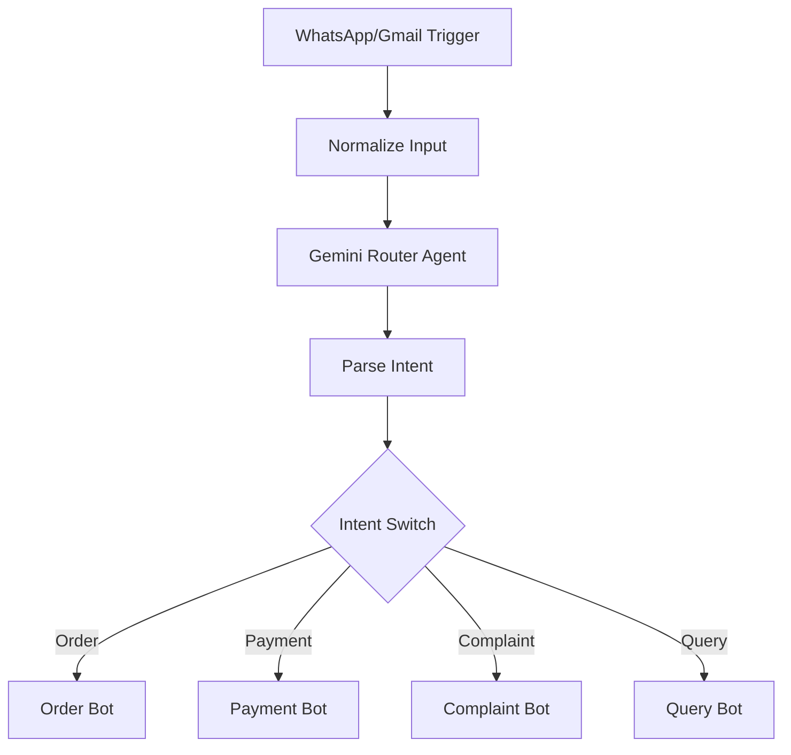

# OpsAgent n8n Workflow Logic

> **For the Team:** This document explains the **Multi-Agent Router** logic implemented in our n8n workflow (`n8n.json`).

---

## 1. Visual Workflow Overview



---

## 2. Step-by-Step Logic

### Step 1: Ingestion
-   **Nodes**: `WhatsApp Webhook`, `Gmail Trigger`
-   **Purpose**: Capture incoming messages from external platforms.
-   **Output**: Unified into a standard format by `Normalize Input`:
    ```json
    {
      "message": "I want 5 pens...",
      "source": "whatsapp",
      "sender_info": "+919876543210"
    }
    ```

### Step 2: Intelligence (The Brain)
-   **Nodes**: `Gemini Router Agent`, `Parse Intent`
-   **Model**: `gemini-2.5-flash`
-   **Prompt**: Analyzes the text and classifies it into one of four intents: `order`, `payment`, `complaint`, `query`. It also extracts structured data (items, quantities, amounts).

### Step 3: Routing (The Traffic Controller)
-   **Node**: `Intent Switch`
-   **Logic**:
    -   If `intent == 'order'` -> Route to Output 0
    -   If `intent == 'payment'` -> Route to Output 1
    -   If `intent == 'complaint'` -> Route to Output 2
    -   If `intent == 'query'` -> Route to Output 3

### Step 4: Execution (The Specialized Bots)

#### 🛒 Order Bot (Output 0)
1.  **Lookup Customer**: Checks if customer exists via `GET /api/customers?search={name}`.
2.  **Create Customer**: If not found, creates a new profile via `POST /api/customers`.
3.  **Create Order**: Posts the order details to `POST /api/orders` with status `pending`.

#### 💰 Payment Bot (Output 1)
1.  **Log Payment**: Directly calls `POST /api/payments` to record the transaction. Logs method (UPI/Cash) and amount.

#### 🚨 Complaint Bot (Output 2)
1.  **Raise Alert**: Calls `POST /api/dashboard/alerts` with `severity: critical`. This triggers a red alert on the OpsAgent Dashboard.

#### ❓ Query Bot (Output 3)
1.  **Log Inquiry**: Calls `POST /api/dashboard/alerts` with `severity: info`. Notifies the user that a customer has a question.

---

## 3. How to Test
1.  **Order**: "Send 2 notebooks to Mumbai."
2.  **Payment**: "Paid 500 rupees via GPay."
3.  **Complaint**: "The product was damaged."
4.  **Query**: "Do you deliver on Sundays?"

Each message will automatically trigger the corresponding API call and update the OpsAgent Database.
